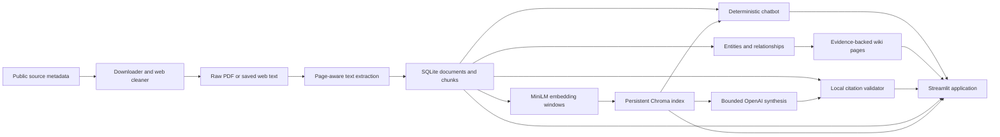

# Conservation Document Intelligence Prototype

## Implementation and System Design Report

**Project:** Conservation Document Intelligence Prototype  
**Implementation status:** Local and private Hugging Face deployment verified  
**Hosted environment:** Private Docker-based Hugging Face Space  
**Primary interface:** Streamlit  

## 1. Executive summary

The Conservation Document Intelligence Prototype is a reproducible research application for exploring a bounded collection of public conservation documents. It converts heterogeneous PDF and web sources into page-aware text, structured SQLite records, a local semantic index, provenance-bearing entities and relationships, persistent wiki pages, cited chatbot answers, and repeatable evaluation outputs.

The system was deliberately designed around a local evidence layer rather than around an external large-language-model knowledge base. All retrieval is performed against precomputed local artifacts. The deterministic chatbot can operate without an API key or network call. When optional OpenAI synthesis is enabled, the model receives only the current question and a small set of locally retrieved excerpts. It does not receive the complete corpus, raw PDFs, conversation history, or access to browsing and tools.

The most important implementation principle is that the model is not trusted to create citations. The model may select temporary evidence identifiers from a constrained set, but local code validates those identifiers against immutable SQLite provenance and renders the final document citations and source links. Invalid, unsupported, or unsafe output is rejected and replaced with deterministic fallback behavior.

The production-style deployment is also separated from corpus construction. Hugging Face startup loads a packaged SQLite database, Chroma vector index, local embedding model, wiki pages, and evaluation results. It never downloads the corpus or regenerates extraction, chunks, embeddings, entities, or wiki pages.

## 2. Project objectives

The implementation was developed to demonstrate that a small public-document intelligence system can provide:

- A transparent, inspectable corpus with stable document identifiers.
- Keyword and semantic retrieval with page or Web provenance.
- Deterministic, evidence-backed summaries and inventories.
- Structured entities and relationships that retain their source sentence.
- Persistent wiki pages derived from the same evidence layer.
- Optional AI synthesis without surrendering citation control to the model.
- Explicit insufficient-evidence behavior instead of fabricated answers.
- Reproducible evaluation and deployment artifacts.
- A private, read-only hosted application that does not rebuild its corpus at startup.

The prototype is not intended to be an authoritative conservation database, an unrestricted web crawler, or a substitute for expert review of source documents.

## 3. System architecture

The application has two distinct operating planes:

1. **Offline construction plane:** downloads and extracts public sources, constructs the database and vector index, extracts entities and relationships, generates wiki pages, and produces evaluation artifacts.
2. **Read-only application plane:** loads the already-built artifacts and serves Corpus, Search, Wiki, Chatbot, and Evaluation functions.



### 3.1 Core technologies

- **Python 3.11:** implementation and hosted runtime.
- **Streamlit:** five-tab interactive interface and per-session state.
- **SQLite:** canonical document, chunk, entity, relationship, and wiki metadata.
- **Chroma:** persistent semantic vector index.
- **sentence-transformers/all-MiniLM-L6-v2:** local embedding model.
- **OpenAI Responses API:** optional bounded synthesis layer.
- **Docker:** reproducible hosted runtime.
- **Hugging Face Spaces and Xet storage:** private deployment and large binary artifact storage.

## 4. Corpus design and source governance

### 4.1 Metadata as the source of truth

`data/metadata.csv` defines the 35-source corpus, with stable identifiers from `DOC001` through `DOC035`. Metadata records preserve title, year, agency, topic, original URL, local-file mapping, file type, download status, and explanatory notes.

The metadata file also documents cases where the original source could not be downloaded directly and a representative document or transparent substitution was selected. The original URL remains recorded. This makes substitutions reviewable rather than silently replacing one source with another.

### 4.2 Download behavior

`scripts/01_download_sources.py` processes each metadata record independently. Important safeguards include:

- Repository-relative paths are resolved and checked so downloads cannot escape the project directory.
- Existing files are retained unless overwrite behavior is explicitly requested.
- Requests use a named project user agent and bounded timeout.
- PDF responses must begin with a PDF signature.
- HTML pages are reduced to readable main/article text after scripts, forms, navigation, headers, footers, and similar boilerplate are removed.
- Files are written to a temporary file and moved into place only after a successful download.
- A failure in one remote source does not stop the rest of the corpus.
- Download status is written back to metadata as downloaded, saved webpage text, representative selection, substitution, or failure.

The final baseline contains 32 locally usable sources—20 PDFs and 12 saved web/text sources—and three sources requiring manual intervention.

## 5. Text extraction and provenance preservation

`scripts/02_extract_text.py` converts raw sources into normalized UTF-8 text files under the local processed-data directory.

For PDFs, text is extracted one page at a time with `pypdf`. Explicit markers are inserted in the processed text:

```text
--- Page 1 ---
...
--- Page 2 ---
...
```

These markers are carried into chunk construction so citations can point to the actual page or inclusive page range. Web-derived text does not receive invented page numbers; downstream records identify its location as `Web`.

Each file is handled independently. Existing processed files are retained by default, empty extraction is treated as a failure, and one malformed PDF does not terminate the complete extraction run.

## 6. SQLite database and chunk construction

### 6.1 Chunking strategy

`scripts/03_build_chunks.py` parses the processed page markers and pairs every word with its originating page. Documents are split into deterministic chunks targeting approximately 800 words with 100 words of overlap.

Chunk boundaries are distributed so the average chunk remains near the target size. When a chunk crosses pages, its location becomes an inclusive range such as `16-20`. Web sources remain labeled `Web`.

Each chunk receives a stable identifier:

```text
DOC002_CHUNK_0001
DOC002_CHUNK_0002
```

The current corpus contains 977 citation-bearing SQLite chunks.

### 6.2 Canonical tables

The initial schema contains:

**`documents`**

- `doc_id` primary key
- `title`
- `year`
- `agency`
- `topic`
- `url`
- `local_file`
- `file_type`

**`chunks`**

- `chunk_id` primary key
- `doc_id` foreign key
- `page`
- `chunk_text`
- `source_url`

An index on `chunks.doc_id` supports document-level lookup. Later pipeline stages add `entities`, `relations`, and `wiki_pages` tables.

Database rebuilding occurs in a transaction. Existing document and chunk rows are deleted and replaced, preventing duplicated or stale rows on repeat builds. Validation checks confirm document counts, per-document chunk counts, foreign-key ownership, source URLs, and location labels.

## 7. Semantic index implementation

### 7.1 Why embedding windows differ from citation chunks

The 600–900 word SQLite chunks are appropriate for human-readable evidence but too large for precise MiniLM retrieval. `scripts/04_build_vector_index.py` therefore creates smaller overlapping embedding windows without changing the original SQLite records.

Each chunk is divided into windows targeting:

- 180 words per window
- 40 words of overlap
- A hard ceiling of 240 model tokens

OCR dot leaders and punctuation-only units are removed before windowing. A binary search shortens token-dense windows so they remain within the embedding model limit without splitting individual words.

Window identifiers retain the parent chunk identity:

```text
DOC002_CHUNK_0004_WIN_01
```

The implemented corpus contains 6,376 embedding windows.

### 7.2 Chroma storage

Windows are embedded in batches with `sentence-transformers/all-MiniLM-L6-v2` and written to the persistent Chroma collection `conservation_chunks`. Chroma metadata preserves the original chunk ID, document ID, page/Web location, and source URL.

The collection is cleared before every offline rebuild, which prevents stale or duplicate vectors. At query time, matching windows are regrouped by their original SQLite chunks. The highest semantic score represents the chunk while final evidence text and source metadata are recovered from SQLite.

This design uses small windows for retrieval accuracy while retaining larger, stable chunks for provenance and readable evidence.

## 8. Entity and relationship extraction

`scripts/05_extract_entities.py` uses transparent rules and controlled vocabularies rather than a hidden external extraction model.

### 8.1 Entity types

The controlled extraction layer covers:

- Species
- Habitats
- Wetlands
- Agencies and conservation organizations
- Locations and rivers
- Threats
- Programs and initiatives
- Policies and acts
- Dates

Canonical names are associated with documented variants and abbreviations. Additional regular expressions identify rivers, dates, titled programs, and policies. Generic and misleading matches are explicitly excluded.

Every entity record includes:

- A stable hash-derived entity ID
- Normalized name and entity type
- Document and chunk ownership
- Page/Web location
- The exact supporting sentence
- A rule-specific confidence value

The current database contains 8,681 provenance-bearing entity records.

### 8.2 Relationships

Relationships are created only when sentence-level patterns support them. Implemented relations include:

- `document_mentions_species`
- `document_mentions_location`
- `species_uses_habitat`
- `threat_affects_species`
- `agency_manages_program`

Stronger semantic relations require an appropriate verb or phrase. For example, the presence of the word “Management” in a program title is not sufficient to establish that a nearby agency manages it.

Relationship records retain stable IDs, subject, predicate, object, document and chunk provenance, page/Web location, evidence sentence, and confidence. The current database contains 1,433 relationships.

Entity and relationship records are written both to SQLite and to CSV outputs for inspection.

## 9. Wiki generation

`scripts/06_generate_wiki.py` generates 15 persistent Markdown pages from SQLite entities, relationships, and their owning chunks.

Candidate entities are scored from:

- Number of supporting documents
- Number of occurrences
- Extracted relationship count
- Confidence
- Small transparent relevance adjustments

Generated pages include:

- Entity name and type
- Corpus-level occurrence summary
- Key facts with citations
- Related documents
- Explicit extracted relationships
- Clearly labeled co-occurrence information
- Evidence excerpts with chunk identifiers
- Open research questions derived from gaps in the evidence

The wiki intentionally distinguishes explicit relationships from co-occurrence. A statement that two entities occur in the same evidence is not presented as proof of a causal or management relationship.

Page metadata is stored in SQLite’s `wiki_pages` table. Stable page IDs are hash-derived from entity type and normalized name.

## 10. Search implementation

The Search tab supports two complementary paths.

### 10.1 Keyword search

`scripts/search_chunks.py` searches SQLite chunks and constructs readable snippets around matching query terms. Results include title, document ID, page/Web location, source URL, and evidence excerpt.

### 10.2 Semantic search

`scripts/semantic_search.py` loads the local MiniLM model and the process-scoped Chroma index copy. It embeds the query, retrieves matching windows, regroups them into citation-bearing chunks, validates document ownership against SQLite, and returns diversified results with trusted local metadata.

Semantic similarity is treated as a retrieval signal—not as proof that a result answers the question. Later chatbot stages apply additional quality, lexical-support, and sufficiency checks.

## 11. Deterministic chatbot

`scripts/chatbot.py` implements the no-API answer path used both as a primary capability and as the universal fallback.

The deterministic path:

1. Retrieves semantic evidence locally.
2. Rejects low-quality table-of-contents fragments, lists, and weak sentences.
3. Selects query-relevant sentences from owning SQLite chunks.
4. Diversifies evidence across documents and removes near-duplicates.
5. Detects structured entity-inventory intents for agencies, threats, species, and habitats.
6. Computes entity rankings directly from SQLite, including exact occurrence and document counts.
7. Generates thematic summaries for supported summary questions.
8. Returns a canonical insufficient-evidence response when relevance and lexical support are inadequate.
9. Renders citations from local document and location fields.

Representative evidence for structured inventories is greedily diversified across documents. This avoids making a corpus-wide ranking appear to originate from a single source.

The deterministic response is inspectable and reproducible for the same artifacts and question. It requires no OpenAI configuration.

## 12. Optional hybrid OpenAI synthesis

### 12.1 Routing

`scripts/openai_chatbot.py` wraps the deterministic system with an optional synthesis layer. Some inventory and generated-list questions remain fully local. Other supported questions use local retrieval followed by bounded synthesis when all configuration and request controls permit it.

If OpenAI is disabled, missing, misconfigured, blocked by quota/cooldown, unavailable, or produces invalid output, the deterministic response remains available.

### 12.2 Evidence preparation

Only selected local evidence is sent. Each evidence record contains:

- Temporary identifier such as `E1`
- Chunk ID
- Document ID
- Stored title
- Page/Web location
- Stored source URL
- Exact excerpt
- Semantic score

The request contains the current question and a bounded evidence payload. It does not include full documents, raw PDFs, prior chat messages, or unrelated corpus content. Retrieved excerpts are explicitly labeled as untrusted data so instructions embedded in source documents cannot override the system rules.

For entity inventories, exact local database rankings are added as a trusted local aggregate. The model must preserve every supplied row, ordering, occurrence count, and document count.

### 12.3 Structured output

The Responses API is constrained by a strict JSON schema. The model returns:

- An `insufficient` boolean
- A list of claim objects
- Prose-only `text` for each claim
- An `evidence_ids` array restricted to the supplied E-IDs

The model is instructed not to emit document IDs, page numbers, URLs, Markdown source links, or a detached source list. Local code places evidence references adjacent to their claims before citation validation.

Tools, web browsing, code execution, and response storage are not enabled in the OpenAI request.

## 13. Citation-integrity boundary

`scripts/citation_validation.py` is the authoritative citation layer.

For every referenced evidence item, the validator checks SQLite to confirm:

- The document exists.
- The chunk exists and belongs to that document.
- Page/Web location matches.
- Source URL matches.
- Stored title matches.
- The supplied excerpt is contained in the owning chunk.
- The URL uses an approved HTTP or HTTPS scheme.

The validator rejects:

- Unknown or malformed E-IDs
- Model-created `DOC` citations
- Model-created page references
- Model-created URLs
- Markdown source links
- Detached source/reference lists
- Factual claims without adjacent evidence
- Unsupported corpus-wide or multi-source claims
- SQLite provenance mismatches

After successful validation, local code replaces temporary E-IDs with citations such as `[DOC012, pp. 25–26]` and builds the Sources panel from trusted local records.

Trusted database aggregates can authorize a corpus-wide statement because the counts were computed locally rather than inferred by the model. This exception is explicit and does not weaken ordinary multi-document claim validation.

### 13.1 Repair behavior

One bounded repair request is available only for a narrow formatting failure: malformed evidence-reference formatting that still names supplied evidence IDs. It is not attempted for unknown IDs, invented metadata, unsafe URLs, uncited claims, unsupported multi-source claims, or incomplete trusted aggregates.

If validation still fails, the model response is discarded and the deterministic fallback is displayed.

## 14. Request, cost, and abuse controls

`scripts/openai_config.py` centralizes configuration and validates every value. Secret values are excluded from dataclass representations and safe diagnostics.

The deployed defaults are:

| Setting | Value |
|---|---:|
| `OPENAI_MODEL` | `gpt-5.6-luna` |
| `OPENAI_MAX_OUTPUT_TOKENS` | `600` |
| `OPENAI_REQUEST_TIMEOUT_SECONDS` | `20` |
| `OPENAI_MAX_RETRIES` | `1` |
| `OPENAI_MAX_QUESTION_CHARS` | `750` |
| `OPENAI_MAX_EVIDENCE_ITEMS` | `6` |
| `OPENAI_MAX_CONTEXT_CHARS` | `12000` |
| `OPENAI_SESSION_REQUEST_QUOTA` | `20` |
| `OPENAI_REQUEST_COOLDOWN_SECONDS` | `3` |

`scripts/request_controls.py` maintains per-Streamlit-session quota, cooldown, duplicate-rerun protection, and a separate bounded repair allowance. Only transient failures are retryable. Authentication, configuration, invalid-request, policy, and citation-validation failures are not retried.

`USE_OPENAI_CHATBOT=false` is the immediate kill switch. Disabling it prevents client construction and leaves all local application features operational.

Optional pricing variables affect evaluation estimates only. The application does not dynamically fetch or assume permanent API pricing.

## 15. Streamlit application

`app.py` presents exactly five tabs.

### 15.1 Corpus

Loads the 35 metadata records, displays corpus and download-status counts, supports agency/topic filtering, and presents extraction diagnostics.

### 15.2 Search

Provides keyword and semantic search, configurable result counts, document metadata, snippets, and safe source links.

### 15.3 Wiki

Loads generated Markdown pages and provides entity-type/entity selection. Wiki content is precomputed; normal browsing does not regenerate files.

### 15.4 Chatbot

Stores conversation display state only in the current Streamlit session. Each response identifies its mode, displays validated answer text, shows sanitized fallback status when appropriate, and exposes an expandable trusted Sources panel.

### 15.5 Evaluation

Loads deterministic baseline results and the deterministic-versus-hybrid comparison from packaged JSON. It displays integrity status but does not rerun evaluation during ordinary page use.

`scripts/ui_safety.py` supplies the research disclaimer, privacy notice, safe mode labels, sanitized text rendering, and HTTP/HTTPS source-link filtering.

## 16. Evaluation process

`tests/demo_questions.txt` contains the ten required project questions.

### 16.1 Deterministic baseline

`scripts/07_run_evaluation.py` sends all ten questions through the same deterministic answer function used by the application and writes:

- `outputs/demo_answers.json`
- `outputs/demo_answers.md`

Checks cover answer presence, evidence presence, citation presence, known document IDs, and valid SQLite locations. The result is an integrity baseline rather than a human factual-quality score.

### 16.2 Hybrid comparison

`scripts/08_run_hybrid_evaluation.py` preserves the deterministic baseline and writes a separate hybrid comparison. Offline mode uses a fake Responses client while exercising actual retrieval, structured response handling, citation validation, usage capture, fallback behavior, and security cases.

Live evaluation was introduced cautiously: preflight validation, a single paid smoke question, a bounded ten-question run, diagnostics, and selective tuning. Automated results are retained separately from the deterministic baseline.

### 16.3 Security-oriented tests

The test suite covers cases including:

- Unknown evidence identifiers
- Fabricated document citations and pages
- Arbitrary or unsafe URLs
- Unsupported uncited claims
- Unsupported multi-source claims
- Incomplete structured aggregates
- Prompt-injection-like evidence content
- Empty or malformed model output
- Retry, timeout, quota, cooldown, and kill-switch behavior
- Read-only SQLite and disposable Chroma operation
- Docker packaging and required artifacts

At the final predeployment baseline, all 72 tests passed. Focused citation/hybrid validation passed 41 tests, the ten mocked evaluation questions passed citation integrity, and Docker/offline-container validation succeeded.

## 17. Runtime artifact strategy

Local development uses the build outputs under `db/` when present. Deployment uses a clean tracked copy under `deployment_artifacts/`.

`scripts/runtime_artifacts.py` selects artifacts in this order:

1. An explicit `CONSERVATION_ARTIFACT_ROOT`, if configured.
2. Complete local build artifacts.
3. Packaged deployment artifacts.

The packaged artifact set contains:

- SQLite database
- Chroma vector index
- Local MiniLM model snapshot
- Metadata CSV
- Wiki pages
- Deterministic and hybrid evaluation JSON

Startup validates required paths. A missing artifact produces a configuration error. It does not invoke any offline build script or silently download a replacement.

### 17.1 Read-only database and disposable index

SQLite is opened with a read-only connection. Chroma may perform bookkeeping even for queries, so its packaged index is never opened as the writable working copy. On first semantic use, the vector index is copied to a process-scoped temporary directory. Model caches, lock files, and SQLite sidecars are excluded from that copy.

The temporary index is protected by a process lock, created once, cached for the process lifetime, and discarded on restart. The canonical packaged index remains unchanged.

## 18. Docker and Hugging Face deployment

### 18.1 Docker image

The Dockerfile uses `python:3.11-slim`, installs CPU-only PyTorch and the pinned runtime dependencies, and sets offline model variables:

- `HF_HUB_OFFLINE=1`
- `TRANSFORMERS_OFFLINE=1`
- `TOKENIZERS_PARALLELISM=false`

An unprivileged `app` user runs Streamlit. The image exposes port 7860 and includes a health check against Streamlit’s `/_stcore/health` endpoint.

The Dockerfile uses an explicit allow-list. It copies only application runtime modules, metadata, wiki, evaluation JSON, and packaged artifacts. Downloader, extraction, corpus-building, entity-generation, wiki-generation, tests, raw PDFs, processed text, logs, local caches, virtual environments, and secrets are excluded from the image.

### 18.2 Hosted configuration

The private Hugging Face Space stores `OPENAI_API_KEY` as a Repository Secret. All operational limits are non-sensitive Repository Variables. No secret appears in the repository, Dockerfile, build arguments, Git URL, README, or runtime diagnostics.

The Space is Docker-based, private, and runs on `cpu-basic`. Binary artifacts are stored using Hugging Face Xet because the Hub rejected ordinary Git/LFS handling for the packaged database, index, and model files.

### 18.3 Hosted validation

The verified private deployment demonstrated:

- 35 Corpus records
- Semantic `wetland` search with trusted metadata
- 15 wiki pages
- Local document-inventory routing
- One coherent AI synthesis with locally rendered citations
- Safe insufficient-evidence fallback with zero fabricated citations
- 10/10 deterministic evaluation display
- Successful restart without corpus/index rebuilding
- Successful OpenAI kill-switch operation
- Clean final build and runtime log audit

The normal hosted restart returned to Running in approximately 49 seconds. A variable-change restart during the kill-switch test returned in approximately 67 seconds.

## 19. Security and privacy design

The security model combines repository hygiene, runtime isolation, output validation, and conservative user messaging.

Key controls include:

- `.env`, Streamlit secrets, keys, logs, local databases, caches, raw PDFs, and processed corpus files are ignored or excluded from deployment.
- No user-facing API-key input exists.
- OpenAI receives only the current question and bounded public-corpus excerpts.
- Questions, answers, evidence, and model responses are not intentionally persisted to SQLite, JSON, application logs, or analytics.
- Source URLs are rendered only when they use safe HTTP/HTTPS schemes.
- External model output cannot directly create trusted citations or source links.
- Invalid model output falls back locally.
- The hosted database and canonical vector artifacts operate read-only.
- The application displays research, privacy, and safe-use notices.
- The Space remains private unless the owner deliberately changes access control.

Final repository, image, build-log, and runtime-log reviews found no API key, Hugging Face token, authorization header, environment dump, user-question persistence, response persistence, or unsafe UI traceback.

## 20. Reproducibility and maintenance process

The recommended lifecycle for future corpus or application updates is:

1. Modify metadata or offline pipeline logic locally.
2. Run the complete offline build in documented order.
3. Review corpus counts, failed sources, chunk validation, entity diagnostics, and wiki output.
4. Regenerate deterministic and hybrid evaluation artifacts.
5. Run focused and complete tests.
6. Perform a secret, personal-path, log, and generated-artifact audit.
7. Copy only required immutable artifacts into the deployment package.
8. Verify a clean Docker build and offline container startup.
9. Review the exact deployment candidate.
10. Upload from a clean, approved tree through the authenticated Hugging Face/Xet workflow.
11. Monitor sanitized build and runtime logs.
12. Run a minimal hosted smoke test, restart test, and kill-switch test.

Normal application startup is intentionally not a substitute for this controlled build-and-release process.

## 21. Known limitations

- Three corpus sources still require manual intervention.
- PDF extraction can preserve broken hyphenation, tables, headings, and OCR-like artifacts.
- DOC007 and DOC008 represent the same underlying report, although repeated evidence is deduplicated in downstream presentation.
- Rule-based entities and relationships favor transparency and precision over exhaustive recall.
- Semantic similarity can retrieve topically adjacent rather than directly responsive passages.
- The citation validator proves provenance and structural support; it does not provide unrestricted natural-language entailment verification.
- Automated evaluation is not a replacement for conservation-domain expert review.
- Per-session quota and cooldown controls do not replace OpenAI account budgets, billing alerts, or provider-side rate limits.
- Free Hugging Face CPU hardware can sleep and has noticeable cold-start and first-query latency.
- The approximately 203 MB deployment requires Xet-aware upload handling.

## 22. Conclusion

The prototype was implemented as an evidence system first and an AI synthesis system second. Its foundational artifacts—metadata, page-aware chunks, SQLite provenance, local embeddings, entity evidence, wiki pages, and deterministic answers—remain usable without OpenAI. Optional synthesis improves readability while operating inside a bounded evidence and citation-validation contract.

This separation provides reproducibility, cost control, inspectability, and a reliable fallback path. It also allows the deployed application to remain read-only against precomputed artifacts, avoiding corpus rebuilds, source downloads, or mutable user-history storage in the hosted environment.

The final result is a private, reproducible conservation-document research prototype whose search, wiki, chatbot, and evaluation functions can be traced back to locally controlled source evidence.
